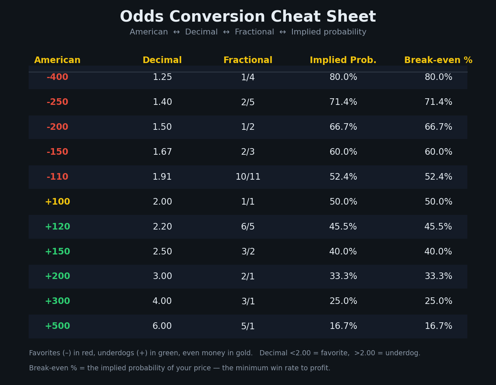
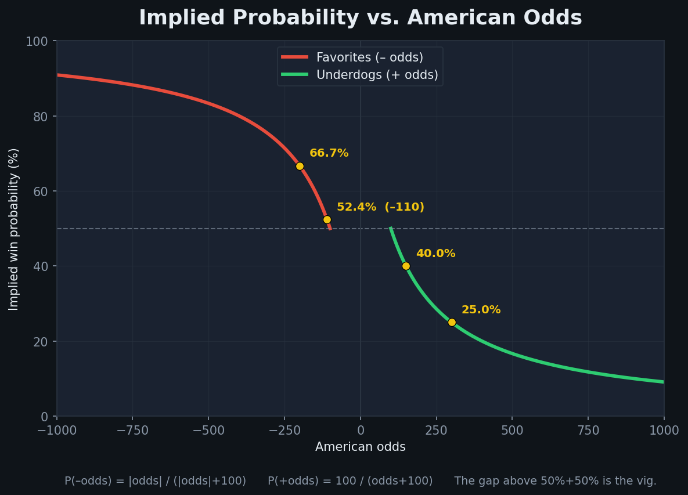

# Odds & Probability

How prices are quoted, converted between formats, turned into probabilities, and how the bookmaker's margin (vig) is built in and stripped out.



---

## 1. The three odds formats

Odds are three notations for the same thing: the price of a bet, encoding **both** the payout and the implied probability.

### American (moneyline / US) odds
Always a positive or negative number centered on $100. Default at US sportsbooks.

- **Negative (favorites), e.g. `-200`** = how much you must **risk to win $100 profit**. `-200` → bet $200 to win $100. `-110` → bet $110 to win $100.
- **Positive (underdogs), e.g. `+150`** = **profit on a $100 stake**. `+150` → bet $100 to win $150.
- The closer to 0 from either side (`-105`, `+105`), the closer to a coin flip.

### Decimal (European) odds
A single number > 1.00 = **total return per $1 staked, including the stake**.
- `payout = stake × decimal`. $100 at `3.00` → $300 total ($200 profit + $100 stake).
- **< 2.00 = favorite, > 2.00 = underdog, exactly 2.00 = even money.**
- `1.91` ≈ the decimal form of `-110`.

### Fractional (UK) odds
Written `a/b` (e.g. `6/4`, `2/1`, `1/4`) = **net profit (a) per stake (b)**, profit only.
- `2/1` ("two to one") → win $2 profit per $1 staked.
- `1/4` → win $1 per $4 staked.
- `1/1` = "evens" / even money.
- Profit = `(numerator × stake) / denominator`.

> One value, three formats: **`10/11` = `-110` = `1.91`**.

---

## 2. Conversion formulas (exact)

Notation: `A` = American (use `|A|` for magnitude), `D` = decimal, fractional = `a/b`.

**American → Decimal**
```
A > 0:  D = (A / 100) + 1          # +150 -> 2.50
A < 0:  D = (100 / |A|) + 1        # -200 -> 1.50 ; -110 -> 1.909
```

**Decimal → American**
```
D >= 2.00:  A = (D - 1) × 100      # 3.00 -> +200
D <  2.00:  A = -100 / (D - 1)     # 1.20 -> -500
```

**Fractional → Decimal**
```
D = (a / b) + 1 = (a + b) / b      # 6/4 -> 2.50
```

**Decimal → Fractional**
```
a/b = (D - 1) reduced to lowest terms   # 2.50 -> 3/2
```

**Fractional → American**
```
a/b >= 1:  A = (a / b) × 100       # 3/1 -> +300
a/b <  1:  A = -100 / (a / b)      # 1/5 -> -500
```

**American → Fractional**
```
A > 0:  a/b = A / 100 reduced      # +400 -> 4/1
A < 0:  a/b = 100 / |A| reduced    # -400 -> 1/4
```

### Master equivalence table

| American | Decimal | Fractional | Implied prob |
|---------|---------|-----------|--------------|
| -400 | 1.25 | 1/4 | 80.0% |
| -200 | 1.50 | 1/2 | 66.67% |
| -110 | 1.909 | 10/11 | 52.38% |
| +100 (even) | 2.00 | 1/1 | 50.0% |
| +150 | 2.50 | 3/2 | 40.0% |
| +400 | 5.00 | 4/1 | 20.0% |

---

## 3. Implied probability

The win probability the price encodes (before stripping vig).

**From American odds**
```
A < 0:  P = |A| / (|A| + 100)      # -150 -> 150/250 = 60.0% ; -110 -> 52.38%
A > 0:  P = 100 / (A + 100)        # +200 -> 100/300 = 33.33% ; +150 -> 40.0%
```

**From decimal odds**
```
P = 1 / D                          # 2.00 -> 50% ; 5.00 -> 20%
```

**From fractional odds**
```
P = b / (a + b)                    # 6/4 -> 4/10 = 40%
```

**Reverse — probability → odds**
```
D = 1 / P                          # 50% -> 2.00 ; 64.3% -> 1.555 (~ -180)
```



---

## 4. Payout / profit

Definitions: **profit** = winnings above your stake; **total payout / return** = profit + stake.

```
# Positive American
profit = stake × (A / 100)          # $100 at +150 -> $150 profit, $250 payout

# Negative American
profit = stake × (100 / |A|)        # $200 at -200 -> $100 profit, $300 payout
                                     # $100 at -110 -> $90.91 profit, $190.91 payout

# Decimal (cleanest)
payout = stake × D
profit = stake × (D - 1)            # $100 × 1.91 = $191 payout, $91 profit
```

---

## 5. Vig / juice / margin / hold / overround

All describe the **bookmaker's built-in commission** — the reason all outcomes' implied probabilities sum to **more than 100%**. ("Vig," "juice," "margin," "overround," "hold" are used largely interchangeably.)

- **Overround** = `(sum of all outcomes' implied probabilities) − 100%`.
- **Hold** = the % of total handle the book keeps with balanced action.

### How `-110/-110` builds in vig
Each side's implied prob = `110/210 = 52.38%`.
```
sum = 52.38% + 52.38% = 104.76%
overround = 104.76% - 100% = 4.76%
```
Often called "10% juice" because you risk $11 to win $10. On balanced action ($1,100 each side), the book pays the winner $2,100 and keeps the $1,100 loser → ~$100 profit on $2,200 handle regardless of outcome.

### Compute hold on a two-way market (worked)
Packers `-200` vs Vikings `+170`:
```
P(Packers) = 200/300 = 66.67%
P(Vikings) = 100/270 = 37.04%
sum = 103.70%  ->  hold ≈ 3.70%
```

### Remove the vig → "no-vig" / fair probability
Normalize each outcome by the total (distributes the margin proportionally):
```
fair P(outcome) = implied P(outcome) / Σ implied P(all outcomes)
```
Continuing the example:
```
Packers fair = 66.67% / 103.70% = 64.3%
Vikings fair = 37.04% / 103.70% = 35.7%   (sum now 100%)
```
The `-110/-110` coin flip de-vigs to exactly 50%/50%. Convert fair probability back to **fair odds** with `D = 1/P` (64.3% → `1.555` ≈ `-180`).

> Advanced bettors sometimes use alternative de-vig methods (Shin, logarithmic/power) for lopsided markets, but proportional normalization above is the standard reference method.

### Multi-way markets (3-way / futures)
Same principle — sum **all** outcomes' implied probabilities, normalize each. Three-way markets (e.g. soccer Home/Draw/Away) typically carry higher vig (often 8–12%). Example booked market summing to 120% → 20% overround.

### Overround compounds on parlays
For per-leg books `B1, B2, …` expressed as decimals (1.20 = a 120% book):
```
parlay overround = (B1 × B2 × ... × Bn) × 100 - 100
```
Four 120% legs → `1.20^4 × 100 - 100 = 107.36%`. This is why parlay EV erodes with each leg.

---

## 6. Even money, pick'em, the line, line movement

- **Even money / "evens":** pays 1:1 — `+100` / `2.00` / `1/1` / 50% pre-vig.
- **Pick'em (PK / "pick"):** a game so close there is no favorite — spread is 0, moneyline near even.
- **"The line":** the number set to balance action — usually the point spread, loosely any posted price.
- **Line movement:** the shift between the **opening line** and the **closing line**, driven by injuries/news, weather, and especially money flow. Heavy action on one side pushes the price to rebalance the book's exposure.
- **Reverse line movement (RLM):** the line moves *toward* the side getting the **minority** of bets — read as a sign sharp money is on the unpopular side.

---

## Sources
- Wikipedia — [Odds](https://en.wikipedia.org/wiki/Odds) and [Mathematics of bookmaking](https://en.wikipedia.org/wiki/Mathematics_of_bookmaking)
- Action Network — [American Odds](https://www.actionnetwork.com/education/american-odds), [Juice](https://www.actionnetwork.com/education/juice), [Remove Juice/Vig](https://www.actionnetwork.com/education/remove-juice-vig), [Reverse Line Movement](https://www.actionnetwork.com/education/reverse-line-movement)
- DraftKings — [Understanding Odds](https://support.draftkings.com/dk/en-us/understanding-odds)
- AceOdds — [Odds Converter](https://www.aceodds.com/bet-calculator/odds-converter.html)
- OddsJam — [Implied Probability](https://oddsjam.com/betting-calculators/implied-probability)

*Verification: conversion and implied-probability formulas and the `-110 → 52.38% / 104.76%` vig math were independently consistent across Wikipedia, Action Network, DraftKings, AceOdds, and OddsJam.*
