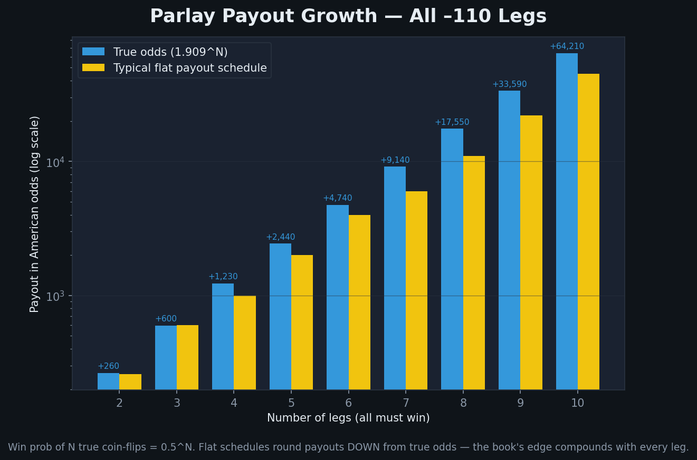

# Parlays & Combination Bets

Parlays, leg pushes/voids, same-game parlays, teasers, round robins, pleasers — with the payout math. Everything reduces to **decimal odds**, because decimal odds include the returned stake and multiply cleanly.



Conversions used throughout: `+A → (A/100)+1`, `-A → (100/|A|)+1`; back: `D≥2 → (D-1)×100`, `D<2 → -100/(D-1)`. Payout = `stake × D`; profit = `stake × (D-1)`.

---

## 1. Parlay — the core bet
Combine 2+ legs on one ticket; **all must win** or the ticket loses. Bigger payout than separate bets because each leg's stake-and-winnings "let it ride" onto the next.

```
parlay_decimal = D1 × D2 × ... × Dn
total_payout   = stake × parlay_decimal
profit         = stake × (parlay_decimal - 1)
```

**Worked (3 mixed legs):**
```
Chiefs -150 -> 1.667
Bills  -130 -> 1.769
Lakers +120 -> 2.20
parlay = 1.667 × 1.769 × 2.20 = 6.487  ->  +549 American
$50 stake -> 50 × 6.487 = $324.35 return ($274.35 profit)
```

**Why bigger payout but higher variance:** three true `-110` coin-flip legs hit `0.5^3 = 12.5%` of the time (1 in 8) but pay only ~`+600` (6-to-1); fair for 12.5% would be `+700`. The gap is the **compounded vig** — the house edge stacks on every leg, so EV erodes as legs increase.

---

## 2. Leg push or void → the leg drops out
A **push** (exact tie) or **void/no-action** (cancelled game, voided prop) leg does **not** kill the parlay. The leg is **removed** and the parlay **re-prices** on the remaining legs (you still must win them).

**Worked:** 3-leg parlay Team A `-110` + Team B `-3` + Team C `+150`. Team B wins by exactly 3 → that leg pushes and drops:
```
remaining: A (-110 -> 1.909) × C (+150 -> 2.50) = 4.77  ->  +377
$100 -> pays $477 IF both remaining legs win
```
A 4-leg `+1200` parlay with one leg pushing becomes a 3-leg parlay (e.g. `+600`). Most books require each leg to "win or push" — a push is just a removed leg.

---

## 3. Same-game parlay (SGP) — correlated legs
Legs from **one game** are **not independent** — they're correlated — so naive multiplication is wrong, and the book re-prices accordingly.

- **Positive correlation** (e.g. Team A wins + its QB throws big + game goes Over): true joint probability is **higher** than independence → book pays **shorter** (worse) odds.
- **Negative correlation** (e.g. Team A wins + opposing RB rushes big): joint probability **lower** → book can offer **longer** odds.

**Worked (positive correlation):** legs at 58.3%, 52.4%, 52.4%.
```
independent: 0.583 × 0.524 × 0.524 = 16.0%  -> fair ~ +600
true (correlated):                  ≈ 21.2% -> fair ~ +429
book actually offers:               ≈ +350   (large hold, ~15% edge)
```
Books price SGPs with correlation models (Gaussian copulas, frequency tables), so the **same SGP varies by book** (+400 / +450 / +380). SGP house edges run **~15–25%** vs ~4–5% for singles. The most obviously correlated combos are restricted or priced hardest.

---

## 4. Teaser — buy points across legs
A parlay with **adjusted** spreads/totals moved in your favor by a fixed number of points, for a **reduced payout**; all legs must still win against the teased numbers.

Football teasers commonly buy **6, 6.5, or 7 points**:

| Teaser | Points | Typical odds |
|---|---|---|
| 2-team | 6 | -120 |
| 2-team | 7 | -140 |
| 3-team | 6 | +160 |
| 3-team | 7 | +130 |

**Worked (2-team, 6-pt):** Jets `+2.5 → +8.5`, Patriots `-7 → -1`. Both teased numbers must cover; at `-120` you risk $12 to win $10.

**Wong teaser:** named after Stanford Wong — use a **6-point** football teaser to cross both key margins **3 and 7** (e.g. dogs `+1.5/+2.5 → +8.5`, favorites `-7.5/-8.5 → -1.5`). Strong historically because so many NFL games land on 3 or 7. Teasers lose value when teased away from key numbers.

---

## 5. Round robin — many small parlays
Auto-generates **multiple smaller parlays** from a set of selections. More resilient than one big parlay (one loss needn't kill everything) but costs more (you fund many bets).

Number of K-team parlays from N picks = `C(N,K) = N! / (K!(N-K)!)`.

**Worked (3 teams "By 2s"):** picks A, B, C → three 2-team parlays: A+B, A+C, B+C.
```
$10 each = $30 total
All 3 win  -> all 3 parlays cash (~$78 return, +$48)
2 of 3 win -> exactly one parlay cashes (+$6 net)   <- a straight 3-leg parlay pays $0 here
1 or 0 win -> lose all $30
```
Named UK structures: **Trixie** (3 picks, 2s+3s = 4 bets), **Patent** (Trixie + singles = 7), **Canadian/Super Yankee** (5 picks = 26), **Heinz** (6 picks = 57).

---

## 6. Pleaser — reverse teaser (brief)
Move the spread/total **against** yourself by the teaser points for a **much larger payout**; all legs must win against the harder lines. A 2-team 6-pt pleaser pays ~`+600` to `+700`. Because you're moving *across* the same key numbers a teaser exploits, pleasers are **strongly −EV** in almost all cases.

---

## 7. Standard parlay payout table (-110 legs)

Two common tables. **True odds** = multiply decimal `1.909^N`. **Flat "Vegas"** = a fixed schedule rounded **down** from true (extra hold, worse for the bettor, compounding with legs).

| Legs | True decimal | True American | Typical flat |
|---|---|---|---|
| 2 | 3.65 | +265 | +260 |
| 3 | 6.96 | +596 | +600 |
| 4 | 13.29 | +1229 | +1000 |
| 5 | 25.37 | +2437 | +2000 |
| 6 | 48.4 | +4845 | +4000 |
| 7 | 92.5 | +9145 | +7500 |
| 8 | 176.5 | +17,554 | +15,000 |
| 9 | 337 | +33,591 | +30,000 |
| 10 | 643 | +64,210 | +70,000 |

> **Takeaway:** always compute `1.909^N` to see the fair price and compare to what's offered. Flat tables (13/5, 6/1, 10/1, 40/1) shave value, and the shave compounds with leg count.

---

## Quick reference
- **Parlay payout = product of decimal odds × stake.** All legs must win.
- **Push/void → leg drops out, re-price on the rest.**
- **SGP → don't multiply; legs are correlated** (positive = shorter, negative = longer; 15–25% hold).
- **Teaser = buy 6/6.5/7 points for lower payout** (~`-120` for 2-team/6-pt). **Wong = 6-pt teaser crossing 3 and 7.**
- **Round robin = C(N,K) smaller parlays;** survives going 2-of-3.
- **Pleaser = reverse teaser** (~`+600–700`; −EV).

---

## Sources
- Action Network — [Parlay Calculator](https://www.actionnetwork.com/betting-calculators/parlay-calculator), [Parlay push handling](https://www.actionnetwork.com/education/what-happens-to-my-parlay-if-a-game-pushes), [Teasers](https://www.actionnetwork.com/education/teaser), [Round Robin](https://www.actionnetwork.com/education/round-robin)
- OddsIndex — [Calculate Parlay Odds](https://oddsindex.com/guides/how-to-calculate-parlay-odds), [SGP Correlation](https://oddsindex.com/guides/same-game-parlay-correlation), [Pleaser Betting](https://oddsindex.com/guides/pleaser-betting-explained)
- Wizard of Odds — [Same-Game Parlays: Mathematics of Correlation](https://wizardofodds.com/article/same-game-parlays-the-mathematics-of-correlation/)
- VegasInsider — [Parlay Calculator](https://www.vegasinsider.com/parlay-calculator/) · DraftKings — [Round Robin](https://help.draftkings.com/hc/en-us/articles/4405232140819-What-is-a-round-robin-RR-bet-US) · SBO.net — [Wong Teasers](https://www.sbo.net/strategy/wong-teasers/)
