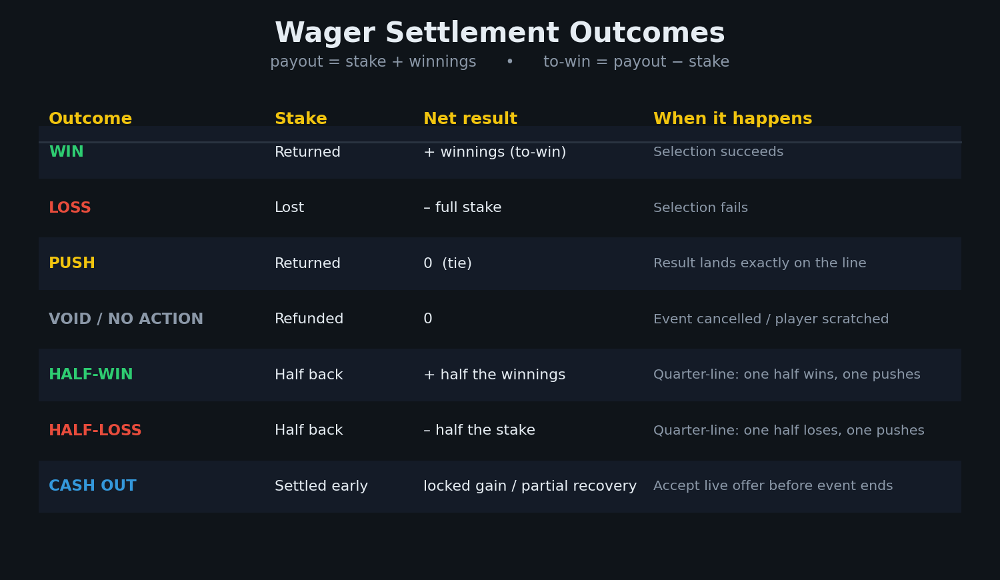

# Settlement & Grading

How a wager resolves and exactly how stake and payout are affected. This is the core logic a tracker needs to **grade** bets.



---

## Core terminology

| Term | Definition |
|---|---|
| **Stake** | Amount wagered. |
| **To-win** (winnings / profit) | Earnings **above** the stake. |
| **Payout** (to-return) | Profit **plus** the original stake returned. |

```
payout  = stake + to-win
to-win  = payout - stake
```

From American odds: `to-win(+A) = stake × (A/100)`; `to-win(-A) = stake × (100/|A|)`.
From decimal: `payout = stake × D`, `to-win = stake × (D-1)`.

---

## The settlement outcomes

### Win
Bet succeeds. Bettor receives **payout = stake + to-win**. Net = +to-win.

### Loss
Bet fails. Stake forfeited, nothing returned. Net = −stake.

### Push (tie)
Result lands **exactly** on the offered number. Graded a tie; **entire stake refunded, no vig kept**. Net = 0. Recorded as the third figure in a record (`4-2-1`).
- Spread: winning margin equals the spread exactly (whole numbers only).
- Total: combined score equals the total exactly.
- Moneyline: tie game with no draw offered (in 3-way markets a tie is a **loss** for team bets).
- Half-point lines (`-3.5`, `47.5`) exist to **eliminate** pushes.

### Void / cancelled / no action
The book cancels the wager and **refunds the stake** — treated as if it never happened. Net = 0. Common causes: event cancelled/postponed/abandoned (e.g. rainout not replayed in the book's window), **player non-participation/scratch** (props), racing non-runners, palpable odds errors, bets placed after the event started.
- **In a parlay:** a void leg is **removed** and the parlay re-prices on the remaining legs.

> **Push vs void:** a *push* happens when the game **is completed** and the result lands on the number; a *void* happens when something **prevents settlement** (cancelled/shortened game, scratch).

### Half-win / half-loss (Asian handicap quarter lines)
When a handicap ends in `.25` or `.75`, the stake **splits 50/50** across the two adjacent half-lines (a quarter lower and a quarter higher), each settled independently and combined. Possible combined results: Win/Win (full win), **Win/Push (half win)**, **Lose/Push (half loss)**, Lose/Lose (full loss).

- **Half win:** one half wins, the other pushes → collect winnings on half the stake, the other half refunded.
- **Half loss:** one half loses, the other pushes → lose half the stake, the other half refunded.

**Worked — `-0.25` favorite, $100** (splits $50 on `0.0` + $50 on `-0.5`):

| Result | 0.0 half | -0.5 half | Combined | Net |
|---|---|---|---|---|
| Favorite wins | Win | Win | Full win | +full winnings |
| **Draw** | Push (refund) | Lose | **Half loss** | −$50 |
| Favorite loses | Lose | Lose | Full loss | −$100 |

**Worked — `-0.75` favorite, $100** (splits $50 on `-0.5` + $50 on `-1.0`), at even money:

| Result | -0.5 half | -1.0 half | Combined | Net |
|---|---|---|---|---|
| Win by 2+ | Win | Win | Full win | +$100 |
| **Win by exactly 1** | Win | Push (refund) | **Half win** | +$50 |
| Draw or loss | Lose | Lose | Full loss | −$100 |

*(Symmetric for underdog `+0.75`: lose by exactly 1 → +0.5 loses, +1.0 pushes = half loss.)*

### Cash out
Settle a wager **early** for a partial payout from the **current live odds** (with the book's margin baked in) — lock in profit on a winner or recover part of the stake on a loser. Accepting **closes the position**; later events don't affect you.
```
cash-out offer ≈ potential_payout × current_win_probability − house_margin
```
Worked: $100 at `+100` (potential $200). Mid-game ~85% to win → fair value `0.85 × $200 = $170`; offer ≈ **$140** (book keeps ~$30) → lock in +$40 instead of potential +$100. The offer **fluctuates** in-play and rises/falls on key events. **Partial cash out** settles only a portion now; the remainder rides at the original odds.

---

## Effect-on-stake summary

| Outcome | Stake | Net result |
|---|---|---|
| Win | returned | + to-win |
| Loss | lost | − stake |
| Push | returned in full (no vig) | 0 |
| Void / no action | refunded in full | 0 |
| Half-win | half returned + winnings on the other half | + ~half winnings |
| Half-loss | half refunded, half lost | − half stake |
| Cash out | settled early at offered amount | locked gain / partial recovery (− book margin) |

**Status values to support in a tracker:** `pending, win, loss, push, void, half_win, half_loss, cashout`. (See [07-tracker-data-schema.md](07-tracker-data-schema.md).)

---

## Sources
- Action Network — [Betting Odds Calculator](https://www.actionnetwork.com/betting-calculators/betting-odds-calculator), [Push](https://www.actionnetwork.com/education/push), [Betting Terms](https://www.actionnetwork.com/how-to-bet-on-sports/general/sports-betting-terms)
- Legal Clarity — [Push in Sports Betting](https://legalclarity.org/push-in-sports-betting-what-it-means-and-how-it-works/)
- The Betting Professionals — [Why Was My Bet Void/Cancelled](https://www.thebettingprofessionals.com/features/why-was-my-bet-void-or-cancelled)
- BettingUSA — [Asian Handicap](https://www.bettingusa.com/sports/soccer/asian-handicap/) · Betstamp — [Asian Handicap](https://www.betstamp.com/education/what-is-an-asian-handicap-in-soccer-betting)
- Boyd's Bets — [Cash Out](https://www.boydsbets.com/cash-out-in-sports-betting/)

*Note: the `-0.75` "win by exactly 1" case is a **half win** (the `-0.5` portion wins, the `-1.0` portion pushes) — verified against two sources after an AI search snippet mis-stated it.*
