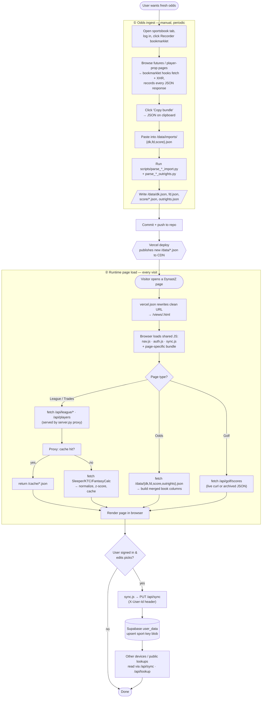

# DynastZ — Architecture & Activity Diagrams

A visual guide to how DynastZ functions, for explaining the app to others. Two views:

1. **Architecture diagram** — the static structure: who hosts what, which services talk to which, and where data lives.
2. **Activity diagram** — the dynamic flow: how betting odds get from a sportsbook into the app, and how a page renders at runtime.

> Diagrams are [Mermaid](https://mermaid.js.org). They render automatically on GitHub and in most Markdown previewers.

---

## 1. Architecture Diagram

```mermaid
graph TD
    %% ===== CLIENTS =====
    subgraph CLIENT["🧑 Clients (browser)"]
        BROWSER["DynastZ web app<br/>(static HTML pages)"]
        BOOK_TAB["Sportsbook tab<br/>+ Odds Recorder bookmarklet"]
    end

    %% ===== VERCEL HOSTING =====
    subgraph VERCEL["▲ Vercel (hosting — dynastz.com)"]
        direction TB
        ROUTER{{"vercel.json<br/>rewrites / redirects / cache headers"}}

        subgraph STATIC["Static CDN assets"]
            VIEWS["/views/*.html<br/>(page templates)"]
            STYLES["/styles/*.css"]
            SCRIPTS["/scripts/*.js"]
            DATAJSON["/data/*.json<br/>(odds + fantasy snapshots)"]
        end

        subgraph FUNCS["Python serverless functions  /api/*"]
            F_AUTH["auth.py<br/>register / claim account"]
            F_SYNC["sync.py<br/>GET·PUT user_data"]
            F_LOOKUP["lookup.py<br/>public pick lookup"]
            F_GOLF["golf/scores.py · golf/[year].py<br/>live + archived leaderboards"]
        end
    end

    %% ===== MIDDLEWARE PROXY =====
    subgraph PROXY["🐍 Middleware proxy — server.py"]
        direction TB
        P_LOGIC["Fetch · normalize · merge<br/>z-score computation"]
        P_CACHE[("/cache/*.json<br/>TTL response cache")]
        P_API["Serves /api/players · /api/league/* ·<br/>/api/trades  (+ mirrors the /api funcs)"]
    end

    %% ===== SUPABASE =====
    subgraph SUPA["🗄️ Supabase (Postgres + REST)"]
        T_USERS[("users<br/>display_name · claim_code")]
        T_DATA[("user_data<br/>sport · key · JSON blob")]
    end

    %% ===== THIRD-PARTY SOURCES =====
    subgraph SRC["🌐 Third-party data sources"]
        SB["Sportsbooks<br/>DraftKings · FanDuel · theScore"]
        SLEEPER["Sleeper API<br/>league · rosters · transactions"]
        KTC["KeepTradeCut"]
        FC["FantasyCalc"]
        FP["FantasyPros"]
        MASTERS["masters.com feeds"]
    end

    %% ===== OFFLINE PIPELINE (repo scripts) =====
    subgraph PIPE["⚙️ Offline ingest (scripts/, run by hand)"]
        IMPORTS[("/data/imports/<br/>dk · fd · score bundles")]
        PARSE["parse_*_import.py<br/>parse_*_outrights.py"]
        FETCHFP["fetch_fp.py"]
    end

    %% ----- runtime edges -----
    BROWSER -->|"clean URL"| ROUTER
    ROUTER -->|"page / asset"| STATIC
    ROUTER -->|"/api/*"| FUNCS
    BROWSER -.->|"fetch /data/*.json"| DATAJSON
    BROWSER -.->|"fetch /api/golf/scores"| F_GOLF

    F_AUTH --> T_USERS
    F_SYNC --> T_DATA
    F_LOOKUP --> T_USERS & T_DATA
    F_GOLF -->|"live curl"| MASTERS

    BROWSER -.->|"league / trade data"| P_API
    P_API --> P_LOGIC
    P_LOGIC <--> P_CACHE
    P_LOGIC --> SLEEPER & KTC & FC

    %% ----- odds capture loop -----
    BOOK_TAB -->|"reads in-page JSON"| SB
    BOOK_TAB -->|"Copy bundle (clipboard)"| IMPORTS
    IMPORTS --> PARSE
    PARSE -->|"writes"| DATAJSON
    FETCHFP --> FP
    FETCHFP -->|"writes /data/fp.json"| DATAJSON

    classDef vercel fill:#e8eaf6,stroke:#3949ab,color:#1a237e;
    classDef supa fill:#e8f5e9,stroke:#2e7d32,color:#1b5e20;
    classDef src fill:#fff3e0,stroke:#ef6c00,color:#e65100;
    classDef proxy fill:#fce4ec,stroke:#c2185b,color:#880e4f;
    classDef pipe fill:#f3e5f5,stroke:#7b1fa2,color:#4a148c;
    class ROUTER,VIEWS,STYLES,SCRIPTS,DATAJSON,F_AUTH,F_SYNC,F_LOOKUP,F_GOLF vercel;
    class T_USERS,T_DATA supa;
    class SB,SLEEPER,KTC,FC,FP,MASTERS src;
    class P_LOGIC,P_CACHE,P_API proxy;
    class IMPORTS,PARSE,FETCHFP pipe;
```

### Reading the architecture

- **Vercel** serves two things behind `vercel.json`: a **static CDN** (HTML pages, CSS, JS, and pre-baked `/data/*.json` snapshots) and a handful of **Python serverless functions** under `/api` (accounts, cross-device sync, public pick lookup, golf scores).
- **Supabase** is the only stateful backend the live site touches — a Postgres `users` + `user_data` pair, reached over its REST API by the `/api` functions. It powers the lightweight account system (display name + claim code) and cross-device sync of a user's picks.
- **`server.py` (middleware proxy)** is the fantasy-data brain. It fetches from **Sleeper / KeepTradeCut / FantasyCalc**, normalizes and merges player values, computes z-scores, caches everything in `/cache`, and exposes the league / trade-calculator endpoints (`/api/players`, `/api/league/*`, `/api/trades`).
- **Sportsbook odds** never come from a server call. The **Odds Recorder bookmarklet** runs inside *your own logged-in* DK / FD / theScore tab, captures the JSON the page already loaded, and copies it to the clipboard. That bundle is pasted into `/data/imports/`, parsed offline by `scripts/parse_*`, and written out as the `/data/*.json` snapshots the Odds page reads. This sidesteps every bot-detection / CSP barrier because it's a real session writing to your own clipboard.

---

## 2. Activity Diagram

Two intertwined flows: the **odds data lifecycle** (offline, periodic) and a **runtime page load** (every visit).

### Reading the activity flow

- **Lane ①** is the human-driven pipeline that refreshes betting markets. It runs occasionally (when lines move), entirely offline, and its only output is a set of committed `/data/*.json` files. A normal Vercel deploy publishes them.
- **Lane ②** is what happens on every visit. The page template is static; the *data* arrives via `fetch` — from CDN JSON (odds), from the `server.py` proxy (league/trades/players, with a cache layer in front of the third-party fantasy APIs), or from the golf function (live or archived leaderboards).
- **Account sync** is the only write path from the browser: `sync.js` mirrors `localStorage` to Supabase via `/api/sync`, and other devices or public `/api/lookup` reads pull it back.

---

## 3. File & Responsibility Summary

### Front-end pages (`/views`)

Pages split into a few **correlated families** plus standalone pages. Families share a context script and a tab/nav component, so they read like one app section.

| Family | Pages | Tied together by |
|---|---|---|
| **Home / misc** | `index`, `football`, `golf-hub`, `account`, `archive`, `acknowledgements` | `nav.js`, `auth.js` |
| **League** (a Sleeper league) | `league`, `league-scout`, `league-trades`, `league-power`, `league-schedule`, `team` | `tabs.js` (shared league tab bar) |
| **Trades / calculator** | `trades`, `trade-calculator`, `team` | `share-trade.js`, `filters.css`, `calculator.css` |
| **Odds** | `odds` (player props **and** outrights in one page) | reads all `/data/*.json` book snapshots |
| **Golf** (`/golf/:year/:tournament/...`) | `golf/season`, `hub`, `leaderboard`, `select-golfers`, `3-ball`, `3-ball-lookup`, `3-ball-results`, `groups`, `group-results`, `ev-model` | `golf-utils.js` (parses tournament from URL) |
| **Masters** (legacy) | `masters/*` | `masters-utils.js`; redirected to `/golf/2026/masters` via `vercel.json` |

### Client JavaScript (`/scripts`)

| File | Role | Used by |
|---|---|---|
| `nav.js` | Shared nav + hamburger drawer | **every** page |
| `auth.js` | Account (display name + claim code) on top of `localStorage` | most pages |
| `sync.js` | Bridges `localStorage` ⇄ Supabase via `/api/sync` | pages with savable picks |
| `tabs.js` | League tab bar | league family |
| `golf-utils.js` / `masters-utils.js` | Score formatting, tournament context, `/api/golf/scores` fetch | golf / masters families |
| `share-trade.js` | Render a trade as a shareable image | trade calculator, scout |
| `odds-recorder.js` | **Bookmarklet source** — fetch/XHR hooks that capture sportsbook JSON (compiled to `odds-recorder.bookmarklet.txt`, installed via `odds-recorder.install.html`) | runs in the sportsbook tab, not on DynastZ |

### Styles (`/styles`)

`styles.css` is the global base loaded everywhere. The rest are scoped: `index.css` (landing), `masters.css` (all golf/masters), `league.css` + `league-schedule.css` + `scout.css` (league family), `trades.css` + `filters.css` (trade browsing), `calculator.css` (trade calculator), `team.css` (roster view).

### Server / serverless (Python)

| File | Where it runs | Responsibility |
|---|---|---|
| `api/auth.py` | Vercel function | Register / claim accounts → Supabase `users` |
| `api/sync.py` | Vercel function | GET/PUT a user's `user_data` blobs (auth via `X-User-Id`) |
| `api/lookup.py` | Vercel function | Public read of another user's 3-ball picks by username |
| `api/golf/scores.py`, `api/golf/[year].py` | Vercel function | Live (`curl` masters.com) + archived golf leaderboards; serve season page |
| `server.py` | Middleware proxy | Fetches/normalizes/merges Sleeper · KTC · FantasyCalc, computes z-scores, caches in `/cache`, serves `/api/players`, `/api/league/*`, `/api/trades` |

### Data (`/data`)

- **Sportsbook snapshots:** `dk.json`, `fd.json`, `score/*.json`, `outrights.json` — produced by the offline parse scripts from `/data/imports/` Recorder bundles; consumed by the Odds page.
- **Fantasy:** `fp.json` (FantasyPros, via `fetch_fp.py`), `power_rankings.json`, `transactions_*.json`, `trades.json`.
- **Golf:** `tournaments.json`, `masters/2026.json` (archived leaderboard).
